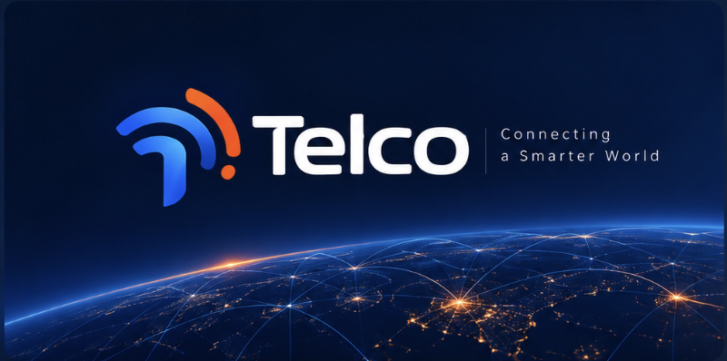

# 📊 Telecom Customer Retention & Churn Analytics

An end-to-end data analytics project evaluating subscriber retention, churn key drivers, and revenue exposure in the telecommunications sector.

---

## 📌 Project Overview
Customer churn directly impacts revenue stability and growth in telecom. This project analyzes subscriber behavior and contractual patterns to identify primary churn drivers, quantify revenue at risk, and deliver actionable retention strategies through an interactive Power BI dashboard.

### Key Objectives:
* Identify high-risk subscriber segments and critical tenure drop-off points.
* Evaluate the financial impact of churn across contract types, payment channels, and service offerings.
* Deliver an executive-level KPI dashboard to support data-driven retention decision-making.

---

## 🛠️ Tech Stack & Architecture
* **Database Management:** PostgreSQL (Data cleaning, schema alignment, metric aggregation, SQL views)
* **Business Intelligence:** Power BI (Data modeling, DAX calculations, interactive reporting)
* **Version Control:** Git & GitHub

---

## 📊 Key Findings & Business Insights
* **Subscriber Commitment:** Subscribers on month-to-month contracts exhibit significantly higher churn rates compared to long-term contract holders.
* **Revenue Leakage:** Electronic check payments and non-automated billing channels show a strong correlation with revenue drop-off and churn risk.
* **Service Ecosystem:** The interplay between core connectivity (e.g., Fiber Optic) and add-on services directly impacts customer lifetime value and retention thresholds.

---

## 📈 Dashboard Features
* **Executive Summary Page:** High-level KPIs including total churn rate, lost revenue, and subscriber counts.
* **Churn Driver Analysis:** In-depth breakdown by contract types, service ecosystems, and payment methods.
* **Customer Risk Cohorts:** Highlighting critical segments requiring immediate proactive retention offers.



---

## ⚠️ Scope & Limitations
* **Primary Scope:** This phase focuses on high-impact financial and contractual risk drivers (e.g., tenure, contract length, payment method, monthly charges).
* **Future Roadmap:** Subsequent iterations will incorporate detailed service-level bundling breakdowns (e.g., specific phone service configurations and multi-line adoption) to further refine cross-selling and retention models.

---

## 📁 Repository Structure
```text
├── assets/
│   ├── dataset.zip
│   └── Telco_Logo.png
├── docs/
│   ├── Business_Requirement_Document.md
│   └── Telco_Report.pdf
├── pbix/
│   └── Telco_Churn_Rate.pbix
├── sql/
│   ├── Column_Renaming.sql
│   ├── Revenue_Leakage.sql
│   ├── Service_Ecosystem.sql
│   ├── Subscriber_Commitment.sql
│   └── View_Creation.sql
└── README.md

---

## 👤 Author
**Mani Salehi**  
* [LinkedIn](http://www.linkedin.com/in/mani-salehi-96b054357)  
* [GitHub](https://github.com/ManiSalehi84)
